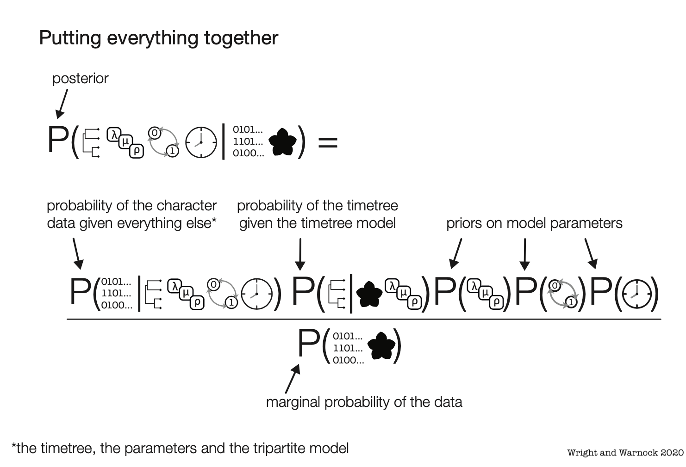

Talk slides, etc.
========================================================

https://bit.ly/3hx80oi

Bayesian Phylogenetics
========================================================
Estimate combinations of the tree topology +  parameters that are plausible given a phylogenetic model and data

Bayesian Phylogenetics
========================================================
Estimate combinations of the tree topology +  parameters that are plausible given a phylogenetic model and data

Bayesian Phylogenetics
========================================================
Estimate combinations of the tree topology +  parameters that are plausible given a phylogenetic model and data

Bayesian Phylogenetics
========================================================
Estimate combinations of the tree topology +  parameters that are plausible given a phylogenetic model and data

Bayesian Phylogenetics
========================================================
Estimate combinations of the tree topology +  parameters that are plausible given a phylogenetic model and data

Bayesian Phylogenetics
========================================================
Estimate combinations of the tree topology +  parameters that are plausible given a phylogenetic model and data

+ Solutions are visited in proportion to how likely they are

Bayesian Phylogenetics
========================================================
Estimate combinations of the tree topology +  parameters that are plausible given a phylogenetic model and data

+ Solutions are visited in proportion to how likely they are
+ A good tree will be visited many times

Bayesian Phylogenetics
========================================================
Estimate combinations of the tree topology +  parameters that are plausible given a phylogenetic model and data

+ Solutions are visited in proportion to how likely they are
+ A good tree will be visited many times
+ **The distribution of solutions is information**

Bayesian Phylogenetics
========================================================
This is a contrast with other methods

A forest or a tree
========================================================

A forest or a tree
========================================================

A forest or a tree
========================================================

A forest or a tree
========================================================

What is a phylogeny?
========================================================

+ A hypothesis about relationships between the tips of the tree

What is a phylogeny?
========================================================

+ A hypothesis about relationships between the tips of the tree
+ Which means we're estimating divergences that occurred millions of years ago

What is a phylogeny?
========================================================

+ A hypothesis about relationships between the tips of the tree
+ Which means we're estimating divergences that occurred millions of years ago
+ In contemporary methods, such as the fossilized birth-death, we may be estimating 
values for a lot of parameters

Phylogenetic data
========================================================
+ In our best-sampled groups, we often have patchy species and locus coverage

Phylogenetic data
========================================================
+ In our best-sampled groups, we often have patchy species and locus coverage
+ In the fossil record, we might hope to be able to sample a miniscule fragment 
of paleodiversity

Phylogenetic data
========================================================
+ In our best-sampled groups, we often have patchy species and locus coverage
+ In the fossil record, we might hope to be able to sample a miniscule fragment 
of paleodiversity
  + With known biases, such as hard parts fossilization, or fossilization associated 
  with life history or ecology traits

Phylogenetic data
========================================================
+ In our best-sampled groups, we often have patchy species and locus coverage
+ In the fossil record, we might hope to be able to sample a miniscule fragment 
of paleodiversity
  + With known biases, such as hard parts fossilization, or fossilization associated 
  with life history or ecology traits
  
Phylogenetic data
========================================================

Ultimately, we are often estimating long-ago events from biased and scarce data.  

Phylogenetic data
========================================================

The best thing we can be is humble 

Phylogenetic data
========================================================

The best thing we can be is humble  

**and that means becoming friendly with uncertainty**

So how do we think about the posterior?
========================================================

In 2018, Sansom et al. did a comparison between Bayesian and parsimony trees using measures of stratigraphic congruence

So how do we think about the posterior?
========================================================

Concluded parsimony trees have better stratigraphic congruence

So how do we think about the posterior?
========================================================

There are many ways to measure stratigraphic congruence

| Metric | Meaning | Range |
|--------|---------|-------|
| Stratigraphic Consistency Index (SCI) | Proportion of nodes for which the oldest descendent of that node is younger than the oldest descendent of that node's ancestor | 0 to 1, with one being perfectly consistent |
| Minimum Implied Gap (MIG) | The sum of the branch lengths excluding tip durations | Positive numbers in millions of years |
| Relative Completeness Index (RCI) |  MIG score proportional to the summed length of tip durations | All real numbers |
| Manhattan Stratigraphic Measure (MSM*) |  MIG for the maximally stratigraphically consistent possible tree divided by the actual MIG | 0 to 1, with one being the most consistent |
| Gap Excess Ratio (GER) |  MIG minus the best possible stratigraphic fit, scaled by the contrast between the best and worst fit values | 0 to 1, with one being the most consistent |

So how do we think about the posterior?
========================================================

These metrics quantify how consistent a phylogeny is with the rock record

| Metric | Meaning | Range |
|--------|---------|-------|
| Stratigraphic Consistency Index (SCI) | Proportion of nodes for which the oldest descendent of that node is younger than the oldest descendent of that node's ancestor | 0 to 1, with one being perfectly consistent |
| Minimum Implied Gap (MIG) | The sum of the branch lengths excluding tip durations | Positive numbers in millions of years |
| Relative Completeness Index (RCI) |  MIG score proportional to the summed length of tip durations | All real numbers |
| Manhattan Stratigraphic Measure (MSM*) |  MIG for the maximally stratigraphically consistent possible tree divided by the actual MIG | 0 to 1, with one being the most consistent |
| Gap Excess Ratio (GER) |  MIG minus the best possible stratigraphic fit, scaled by the contrast between the best and worst fit values | 0 to 1, with one being the most consistent |

So how do we think about the posterior?
========================================================

These metrics quantify how consistent a phylogeny is with the rock record

| Metric | Meaning | Range |
|--------|---------|-------|
| Stratigraphic Consistency Index (SCI) | Proportion of nodes for which the oldest descendent of that node is younger than the oldest descendent of that node's ancestor | 0 to 1, with one being perfectly consistent |
| **Minimum Implied Gap (MIG)** | The sum of the branch lengths excluding tip durations | Positive numbers in millions of years |
| Relative Completeness Index (RCI) |  MIG score proportional to the summed length of tip durations | All real numbers |
| Manhattan Stratigraphic Measure (MSM*) |  MIG for the maximally stratigraphically consistent possible tree divided by the actual MIG | 0 to 1, with one being the most consistent |
| Gap Excess Ratio (GER) |  MIG minus the best possible stratigraphic fit, scaled by the contrast between the best and worst fit values | 0 to 1, with one being the most consistent |

So how do we think about the posterior?
========================================================

Sansom et al. took 500 samples from the posterior and compared those with the most parsimonious tree

So how do we think about the posterior?
========================================================

But is there more information in the posterior than a random sample can show us? 

Treeset visualizations
========================================================
Graphics that display trees in 2-D space based on their proximity to one another

Treeset visualizations
========================================================
Could these be a valuable tool for looking at the posterior sample? 

Treeset visualizations
========================================================
Is this how we see our forest?

Methods 
========================================================

+ Estimated parsimony trees (TNT, Goloboff and Catalano 2016) and Bayesian trees
(Hoehna et al 2016) for 127 published paleontological matrices

Methods 
========================================================

+ Estimated parsimony trees (TNT, Goloboff and Catalano 2016) and Bayesian trees
(Höhna et al 2016) for 127 published paleontological matrices

+ Calculated stratigraphic congruence for all equally-parsimonious trees and the Bayesian
posterior sample in the R package Strap (Bell and Lloyd 2015)

Methods 
========================================================

+ Estimated parsimony trees (TNT, Goloboff and Catalano 2016) and Bayesian trees
(Hoehna et al 2016) for 127 published paleontological matrices

+ Calculated stratigraphic congruence for all equally-parsimonious trees and the Bayesian
posterior sample in the R package Strap (Bell and Lloyd 2015)

+ Modified the RWTY (Warren, Geneva and Lanfear 2017) to color points in
the treespace by MIG score

Methods 
========================================================

+ Estimated parsimony trees (TNT, Goloboff and Catalano 2016) and Bayesian trees
(Hoehna et al 2016) for 127 published paleontological matrices

+ Calculated stratigraphic congruence for all equally-parsimonious trees and the Bayesian
posterior sample in the R package Strap (Bell and Lloyd 2015)

+ Modified the RWTY (Warren, Geneva and Lanfear 2017) to color points in
the treespace by MIG score

+ Also calculated some basic summary tables across thee datasets using tidyverse

Results
========================================================

+ 63% of datasets had the highest _average_ stratigraphic congruence with parsimony

Results
========================================================

+ 63% of datasets had the highest _average_ stratigraphic congruence with parsimony
+ In 94% of datasets the highest stratigraphic congruence value was observed in the Bayesian posterior sample

Results
========================================================

+ 63% of datasets had the highest _average_ stratigraphic congruence with parsimony
+ In 94% of datasets the highest stratigraphic congruence value was observed in the Bayesian posterior sample
+ In 99% of datasets the lowest stratigraphic congruence was found in the Bayesian posterior sample

Results
========================================================

+ 63% of datasets had the highest _average_ stratigraphic congruence with parsimony
+ In 94% of datasets the highest stratigraphic congruence value was observed in the Bayesian posterior sample
+ In 99% of datasets the lowest stratigraphic congruence was found in the Bayesian posterior sample

Results
========================================================

Example dataset: Yates (2003)  

{width=.75}

Results
========================================================

Example dataset: Yates (2003)

Results
========================================================

Example dataset: Demar 2013
{width=.75}

Results
========================================================

Example dataset: Demar 2013

Summary 
========================================================

Bayesian methods estimate a sample of solutions  

Summary 
========================================================

Bayesian methods estimate a sample of solutions  

Unlike other methods, the distribution itself may be important

Summary 
========================================================

Bayesian methods estimate a sample of solutions  

Unlike other methods, the distribution itself may be important  

Looking at the full distribution of trees can provide us with information that one
solution itself may not

Summary 
========================================================

We shouldn't be asking "Is Bayes or parsimony better?"  

Summary 
========================================================

We shouldn't be asking "Is Bayes or parsimony better?"  

We should instead be looking for ways to comfortably visualize variation in large datasets

Summary 
========================================================

We shouldn't be asking "Is Bayes or parsimony better?"  

We should instead be looking for ways to comfortably visualize variation in large datasets

Treespace visualizations provide an easy and intuitive way to do this

Thank You!
========================================================

A sincere thank you to the organizers of this excellent event!

To Dan Warren and Rob Lanfear for the endlessly hackable RWTY software

And to my co-author and partner in crime, Dr. Graeme Lloyd

